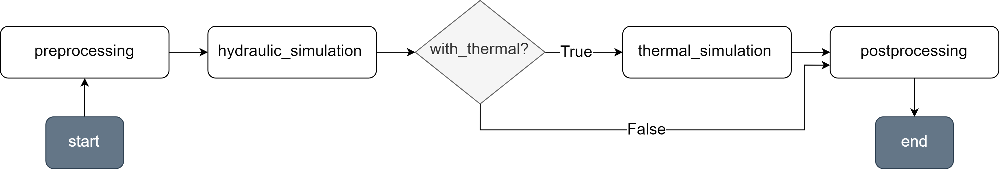
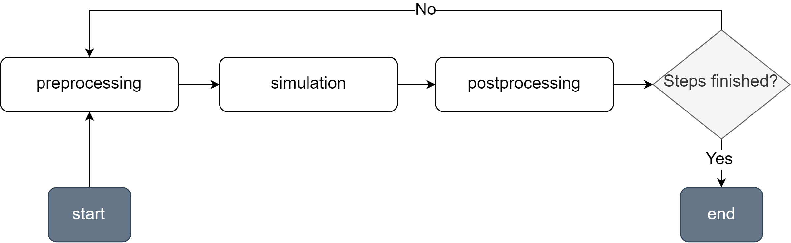

Loops
======

PyDHN includes some classes, called **loops**, to automate the simulation workflow. Loops are used to define the logic of a single simulation step as well as to create a pipeline for a multi-step simulation.

Abstract Loop
--------------

The class :class:`~pydhn.solving.loops.AbstractLoop` provides a blueprint for all loop classes. A loop defines several phases, or steps, and the logic that governs the transition between one phase and the next. In principle, all loops have a "**start**" and an "**end**" phases that constitute the entry and exit point of the loop. For each phase, a private method is implemented which includes a call to :meth:`~pydhn.solving.loops.AbstractLoop._set_current_phase` defining what the next phase will be.

Once the workflow logic is defined, the process can be initiated using the method :meth:`~pydhn.solving.loops.AbstractLoop.execute` with the relevant arguments.

Simple Step
--------------

The :class:`~pydhn.solving.loops.SimpleStep` loop defines the logic for a single simulation step using the default functions :func:`~pydhn.solving.hydraulic_simulation.solve_hydraulics` and :func:`~pydhn.solving.thermal_simulation.solve_thermal`. It implements the following logic:

|

Where:

1. **start** is the workflow entry point.
2. **preprocessing** is a placeholder and just sets the next phase.
3. **hydraulic_simulation** runs the hydraulic simulation.
4. **thermal_simulation** runs the thermal simulation.
5. **postprocessing** is a placeholder and just sets the next phase.
6. **end** marks the end of the workflow.

The results are returned in a :class:`~pydhn.classes.results.Results` object.

The following snippet shows an usage example:

.. _SimpStepSnippet:

.. doctest::

    >>> from pydhn.fluids import ConstantWater
    >>> from pydhn.networks.load_networks import star_network
    >>> from pydhn.soils import Soil
    >>> from pydhn.solving import SimpleStep
    >>> net = star_network()
    >>> fluid = ConstantWater()
    >>> soil = Soil(k=0.8, temp=5)
    >>> # Set the hydraulic setpoint and control type of substations as "mass_flow"
    >>> net.set_edge_attribute(
    ...     value="mass_flow", name="setpoint_type_hyd", mask=net.consumers_mask
    ... )
    >>> net.set_edge_attributes(
    ...     values=[0.4, 0.3, 0.1], name="setpoint_value_hyd", mask=net.consumers_mask
    ... )
    >>> net.set_edge_attribute(value="mass_flow", name="control_type", mask=net.consumers_mask)
    >>> # Set the thermal setpoint type of the heating station as "t_out"
    >>> net.set_edge_attribute(
    ...     value="t_out", name="setpoint_type_hx", mask=net.producers_mask
    ... )
    >>> # Initialize the base loop with custom kwargs for the simulation
    >>> hyd_kwargs = {"error_threshold": 0.1, "verbose": 0}
    >>> thermal_kwargs = {"error_threshold": 1e-12, "verbose": 0}
    >>> base_loop = SimpleStep(
    ...     hydraulic_sim_kwargs=hyd_kwargs,
    ...     thermal_sim_kwargs=thermal_kwargs,
    ...     with_thermal=True,
    ... )
    >>> # Run the simulation, which will return an instance of Results.
    >>> results = base_loop.execute(net=net, fluid=fluid, soil=soil) # doctest: +SKIP
    >>> # Check the node temperature
    >>> print(results['nodes']['temperature'][0].round(2)) # °C # doctest: +SKIP
    [80.   79.66 79.58 79.56 79.33 79.21 79.2  79.49 49.01 49.17 49.37 49.04
     49.14 49.21 49.2  49.49]

Scheduler
--------------

The :class:`~pydhn.solving.loops.Scheduler` loop defines the logic for a multi-step simulation using any base loop (by default, :class:`~pydhn.solving.loops.SimpleStep`) with the possibility of varying any component attribute over time. It implements the following logic:

|

Where:

1. **start** is the workflow entry point.
2. **preprocessing** updates component arguments (for example, setpoints) according to the simulation step ID and the provided schedules. Schedules are Pandas dataframes where the index contains the step IDs and the columns are the names of the edges for which the value should be updated. They are passed as a dictionary where the key is the attribute name and the value is the schedule itself.
3. **simulation** runs the simulation using the base loop provided.
4. **postprocessing** updates the simulation step ID and checks if all the steps have been simulated.
5. **end** marks the end of the workflow.

The results are returned in a :class:`~pydhn.classes.results.Results` object.

The following code block extends the :ref:`previous snippet <SimpStepSnippet>` to include an example of usage of the Scheduler loop:

.. doctest::

    >>> import pandas as pd
    >>> from pydhn.solving import Scheduler
    >>> # Prepare schedules: each schedule will modify one attribute over time
    >>> # Consumer mass flow
    >>> imposed_mass_flows = {
    ...     "SUB1": [0.01, 0.02, 0.03, 0.03, 0.02],
    ...     "SUB2": [0.0, 0.0, 0.01, 0.01, 0.0],
    ...     "SUB3": [0.03, 0.05, 0.05, 0.08, 0.1],
    ... }
    >>> imposed_mass_flows_df = pd.DataFrame(imposed_mass_flows)
    >>> # Producer outlet temperature
    >>> imposed_t_out = {"main": [80, 81, 82, 82, 84]}
    >>> imposed_t_out_df = pd.DataFrame(imposed_t_out)
    >>> # Store the schedules in a dictionary
    >>> schedules = {
    ...     "setpoint_value_hyd": imposed_mass_flows_df,
    ...     "setpoint_value_hx": imposed_t_out_df,
    ... }
    >>> # Initialize the scheduler, which will take care of updating the attributes
    >>> # according to the schedules and run the specified number of steps
    >>> scheduler = Scheduler(base_loop=base_loop, schedules=schedules, steps=5)
    >>> # Run the simulation, which will return an instance of Results
    >>> results_sched = scheduler.execute(net=net, fluid=fluid, soil=soil) # doctest: +SKIP
    >>> # Check the node temperatures over time
    >>> print(results_sched['nodes']['temperature'].round(2)) # °C # doctest: +SKIP
    [[80.   71.56 68.1  69.85 66.13 35.   66.84 67.1  31.5  34.86 36.59 34.34
      34.78  5.   36.84 37.1 ]
     [81.   76.   73.78 74.97 72.43 35.   73.31 73.13 39.26 41.67 42.77 41.5
      41.4   5.   43.31 43.13]
     [82.   78.03 76.44 77.24 74.8  71.56 76.1  75.77 41.97 43.98 45.38 43.36
      40.01 41.56 46.1  45.77]
     [82.   79.01 77.77 78.37 76.98 73.63 77.21 77.34 44.28 45.87 47.08 45.14
      44.2  43.63 47.21 47.34]
     [84.   80.93 79.64 80.21 79.02 35.   78.43 79.29 46.43 48.11 49.08 47.58
      48.38  5.   48.43 49.29]]
